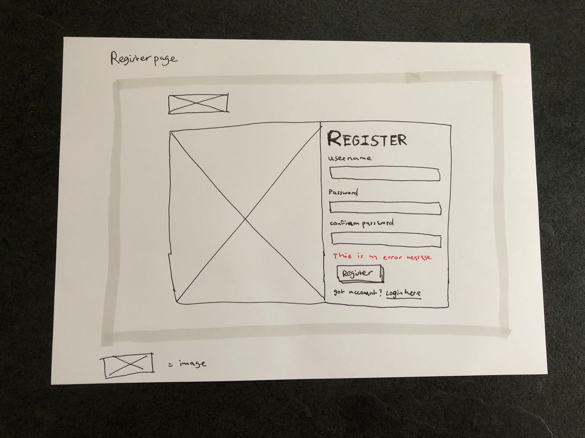
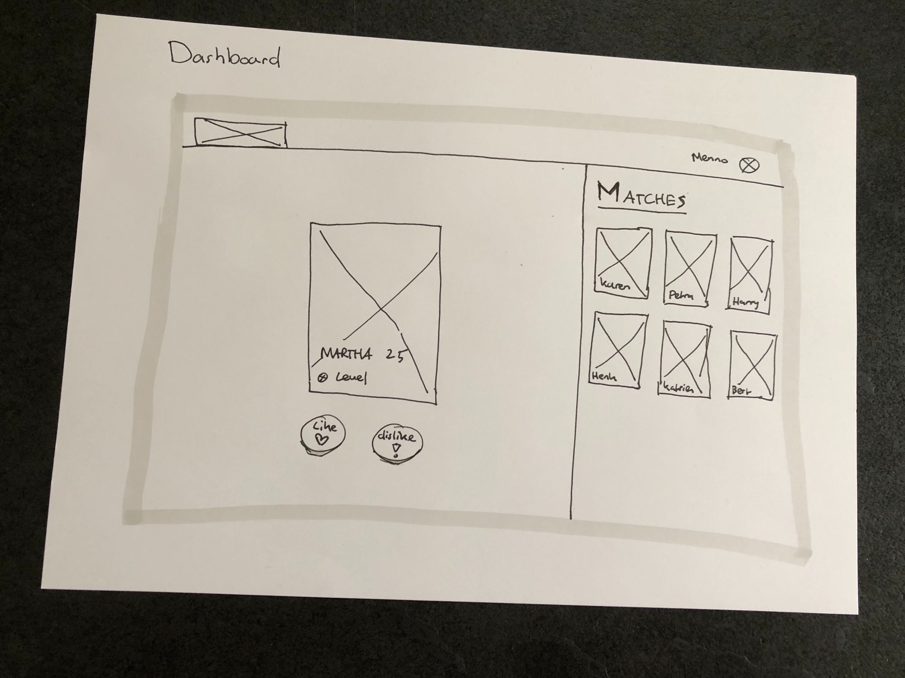

<p align="center">
  
</p>

<h1 align="center">Project Tech Course @cmda-bt 19-20</h1>

<p align="center"><b>HTMLovers brings code lovers together, since us programmers need some extra motivation to get out of our chair and adventure the real world, by and with love.</b>
</p>

<br>

<p align="center">
  <a href="https://project-tech.herokuapp.com/">
    
  </a>
  &nbsp;&nbsp;&nbsp;
  <a href="https://choosealicense.com/licenses/gpl-3.0/">
    
  </a>
</p>

<br>


<br>

## Introduction

This dating web app is made as part of a course from @cmda-bt 19-20. In this course I had to make a progressively enhanced dating app.

You can find a live version of the dating app here: <a href="https://project-tech.herokuapp.com/">HTMLovers</a>

## Table of Contents

- [Installation](#installation)
- [Design Patterns Research](#design-patterns-research)
  - [User Actions](#user-actions)
  - [User Intentions](#user-intentions)
  - [User Search](#user-search)
  - [User Interaction](#user-interaction)
- [Job Story](#job-story)
- [Initial design](#initial-design)
  - [Styleguide](#styleguide)
  - [Wireframes](#wireframes)
    - [Landingpage](#landingpage)
    - [Login page](#login-page)
    - [Register page](#register-page)
    - [First visit](#first-visit)
    - [Dashboard](#dashboard)
- [Application](#application)
  - [Templating](#templating)
    - [Views](#views)
    - [Components](#components)
  - [Database](#database)
    - [Setup](#setup)
    - [Table example](#table-example)
  - [Authentication](#authentication)
  - [Validation](#validation)
- [Needs testing](#needs-testing)
- [Known bugs](#known-bugs)
- [Wishlist](#wishlist)
- [Credits](#credits)
- [Sources](#sources)
- [License](#license)

## Installation

Please read the [Attribution-NonCommercial-NoDerivs 3.0 Unported License (“BY-NC-ND 3.0”)](https://creativecommons.org/licenses/by-nc-nd/3.0/) before you download and use this application and/or material.

<details>
  <summary>Show me the installation steps!</summary>

1. Open your terminal

2. Change the directory to a folder in which you want to clone the files

```bash
cd /~path
```

3. Clone the repository (you're going to need [Git](https://www.linode.com/docs/development/version-control/how-to-install-git-on-linux-mac-and-windows/))

```bash
git clone https://github.com/Mennauu/pt-course-19-20.git
```

4. Change directory to repository in your terminal

```bash
cd pt-course-19-20
```

5. Create a .env file in the root of the repoistory and insert underneath lines. Replace the SESSION_SECRET with a secret of your choice.

```bash
ENVIRONMENT=local

LOCAL_URI=http://localhost:3000/

SESSION_SECRET=Place your own secret here
```

6. Install dependencies from [package.json](https://github.com/Mennauu/browser-technologies-1819/blob/master/package.json)

```bash
npm install
```

7. Run application with [Node](https://nodejs.org/en/) in development mode

```bash
npm run dev
```

</details>

## Design patterns research

<details>
  <summary>Show me this amazing research!</summary>

### User actions


### User intentions


### User search


### User interaction


</details>

## Job story
_When I'm on the dating website, I want to be able to create an account and get matched with other users based on my own and their preferences, so I can feel loved when someone else wants to be matched with me too._

## Initial design

### Styleguide

<details>
  <summary>Show me your styleguide!</summary>


</details>

### Wireframes

<details>
  <summary>Show me your wireframes!</summary>

#### Landingpage


#### Login page


#### Register page



#### First visit


#### Dashboard



</details>

### Wireflow

<details>
  <summary>Show me your wireflow!</summary>


</details>

## Application

HTMLovers is a [server-side rendered](https://www.freecodecamp.org/news/what-exactly-is-client-side-rendering-and-hows-it-different-from-server-side-rendering-bd5c786b340d/) dating web application. You can create an account, setup your information and match with other users based on the given information.

HTMLovers is created using mainly [HTML](https://developer.mozilla.org/nl/docs/Web/HTML), [SCSS](https://sass-lang.com/), [JavaScript](https://developer.mozilla.org/en-US/docs/Learn/JavaScript/First_steps/What_is_JavaScript), [Nunjucks](https://mozilla.github.io/nunjucks/), [NodeJS](https://nodejs.org/en/), [Express](https://expressjs.com/) and [MongoDB](https://www.mongodb.com/).

### Templating

[Nunjucks](https://mozilla.github.io/nunjucks/) is used as a templating engine to render HTML. Nunjucks has been chosen for its easy way of creating macro's, so building component based views is made better, cleaner, easier and above all, more readable. 

#### Views

One default layout has been created for every page on the website. The content from the different pages are injected within a `block content`. It might be the case that you have a _generic_ element that's shown on every page. Look at the code below for a small example, a generic element in this project is a header.

```HTML
<!DOCTYPE html>
<html>
  <head>...</head>
  <body>
    <!-- The header is a 'generic' element in this project because it's shown on every page -->
    

      

    
    <main>
      
        <!-- content will be injected in this block -->
      
    </main>
  </body>
</html>
```

When you want to inject content into the 'block' you have to extend the layout. You can do that like this: 

```



  

```

For instance, this might be how your `home.html` looks.

```







  

    {{ image({
      image: '/assets/images/test.jpeg',
      alt: 'Test'
    }) }}

  


```


#### Components
As you might have seen in the `views` sections, I'm not actually writing any HTML. I'm calling elements like a header, card and image and providing them information. How does that work? Check out the "notification" component underneath, written as a macro. 

```HTML


  <div class="c-notification  {{ data.class }}" js-hook-notification>

      <p class="notification__message">

        {{ data.message }}

      </p>

  </div>


```

I'm defining a macro called notification that contains data. Within the macro I write some HTML which defines the macro. The data within the `if` statements are only shown if you provide the macro with the given data (by name). See that `js-hook-notification`? That's added to call the element in JavaScript, so we don't get messy stuff like searching for a class named notification.

In our view template we can now easily call the macro by importing it like this at the top of the view file:

```javascript

```

Afterwards, we can call the macro within our view.

```javascript
 {{ notification({ 
   message: 'This is a message', 
   class: 'notification__test' 
 }) }}
```

Now if we don't want to render a class, we can just leave it empty or not mention it at all. The if statement within the macro will be false.

**How does a component folder look like?**

In case of the notification folder in my project it looks like this:


Inside the notification folder you can find the HTML, CSS (well ok, SASS) and JavaScript. 3 files that only belong to that given component.

Building components/macros like this makes them reusable. You can reuse them anywere on your site, and also someone else that might start to code within your project. Heck, you can even use the component in different projects.

### Styling

[SASS](https://sass-lang.com/) has been used for styling. It's full of features and actually makes your CSS richer. It's also faster to write SCSS than regular CSS, especially when working component based. The main reason for using SASS over other CSS extensions (or writing regular CSS) is the ability to write variables, functions, and mixins.

Let's take a look again at the `notification` component. It has a SCSS file named _notification.scss. The underscore is a partial for SCSS. It basically means that the file is going to be imported to a `main` stylesheet, in my case `main.scss`. The advantage of using partials is that you can use many files to organize your code and everything will be compiled within a single file. Back to the notifcation..

```SCSS
$notification-transition-speed: 400ms;
$notification-z-index: 10;
$notification-shadow: 0 5px 10px rgba($color-black, 0.15);
$notification-border-radius: 3px;
$notification-background-color: $color-white;
$notification-padding: $global-spacing-sm;
$notification-margin: $global-spacing-md;
$notification-width: $global-spacing * 40;
$notification-color: $color-red;
$notification-font: $font-stack-secondary;
$notification-weight:  $font-weight-bold;

.c-notification {
  background-color: $notification-background-color;
  border-radius: $notification-border-radius;
  box-shadow: $notification-shadow;
  padding: $notification-padding;
  opacity: 0;
  visibility: hidden;
  position: fixed;
  left: $notification-positioning;
  max-width: 100%;
  color: $notification-color;
  font-weight:$notification-weight;
  font-family: $notification-font;
  margin-right: $notification-margin;

  @include screen-tablet-portrait-and-bigger {
    max-width: $notification-width;
  }
}

.notification--is-active {
  opacity: 1;
  visibility: visible;
  z-index: $notification-z-index;
  transition: visibility $notification-transition-speed, opacity $notification-transition-speed;
}
```

As you can see at the top of the files we define a lot of variables. We do this in order to make the component reusable within different projects. For instance, if you use this component within another project, the only thing (in most cases) you will have to do is give values to the variables on top. You don't have to touch the code beneath the variables.

Variables like `$global-spacing` and `$color-red` are globally defined variables, that can be used in every SCSS file. Notice the `@include screen-tablet-portrait-and-bigger`? That's a @mixin that we defined globally. It looks like this:

```SCSS
@mixin screen-tablet-portrait-and-bigger {
  @media only screen and (min-width: em($tablet-portrait-start)) {
    @content;
  }
}
```

All SCSS files are eventually compiled to one css file, which is compressed, revisioned, and minified, on save or build. More about that later!

### JavaScript
I don't want to explain what JavaScript is, but I want to explain how I use JavaScript in this project. All JavaScript (files) being used are imported in a `main-es.js` file, like this:

```JavaScript
import FormLogin from '@components/form-login'
import moduleInit from '@utilities/module-init'
```

I want to talk about the moduleInit, that's being imported. It's a script I didn't write myself, and I have no clue who actually wrote it. Someone from this company: [Dept](https://www.deptagency.com/nl-nl/), probably this guy: [The god of Webdevelopment](https://www.linkedin.com/in/adrianklingen/). Anyway, it reads the dom for elements. You can call it like this:

```JavaScript
moduleInit.sync('[js-hook-form-login]', FormLogin)
```

It will look for an element in the DOM with a data-attribute called `js-hook-form-login`. If an element has been found it will create a new Class, like: `new Class(FormLogin)`.

In the `FormLogin` javascript file it will look like the code underneath. We can call the element directly from the constructor.

```javascript
class FormLogin {
  constructor(element) {
    this.form = element

    this.bindEvents()
  }

  bindEvents() {
    ...
  }

  ...
}
```

Another note: all HTML element that contain some JavaScript actions are called by a data-attribute called js-hook followed by the name of the element. For instance, `js-hook-input-username`.

In a JavaScript file at the top I will create a variable like this.

```javascript
const JS_HOOK_INPUT_USERNAME = '[js-hook-input-username]'
```

To be able to find the element I can now do something in the likes of this
```javascript
const inputUsername = document.querySelector(JS_HOOK_INPUT_USERNAME)

// Maybe I'm calling a input inside a form that's been called by ModuleInit? 
// We can find an element by adding the line underneath in the constructor.
this.inputUsername = element.querySelector(JS_HOOK_INPUT_USERNAME)
```

_All in the name of readability._

### Database

In order to create accounts, save account details and be able to match with other users, we need a **database**. The project is made using JavaScript, NodeJS and Express; [mongoDB](https://www.mongodb.com/) is a perfect database when using these tools, because MongoDB is a document database, which means it stores data in JSON-like documents. [Mongoose](https://mongoosejs.com/) is used as a boilerplate in order to make life a little easier.

#### Setup

_Disclaimer: passwords are hashed with [bcrypt](https://www.npmjs.com/package/bcrypt). bcrypt is used since it has proven to be a realiable encryption method, also passport (which we use for authentication) has an easy integration flow for bcrypt._

<details>
  <summary>Show me the database connection setup and user schema</summary>

#### Database connect
```javascript
class Database {
  constructor() {
    this.connect()
  }

  connect() {
    mongoose.connect(uristring, { useNewUrlParser: true })
  }
}
```

#### Database user schema
```JavaScript
const userSchema = new mongoose.Schema({
  username: String,
  password: String,
  name: String,
  age: Number,
  gender: String,
  attraction: String,
  fromAge: Number,
  toAge: Number,
  level: String,
  avatar: String,
  images: [],
  firstVisit: Boolean,
  liked: [],
  disliked: [],
  matched: [],
})
```
</details>

#### Table example

| _id `objectId` |  images `array` | liked `array` | disliked `array` | matched `array` | username `string` | password `string` | firstVisit `boolean` | age `int` | gender `string` | level `string` | name `string` | avatar `string` | attraction `string` | fromAge `int` | toAge `int` |
|----------------|----------------|---------------|------------------|-----------------|-------------------|-------------------|----------------------|-----------|-----------------|----------------|---------------|-----------------|---------------------|---------------|-------------|
| 5e6e3ecff612c0090673b274 | []               | ['5e6e3ecff612c0090673b274', '5e6e3ecff612c0090673b2cb'] | []               | []              | 'Baas'            | '$2a$10$0BHov9rtizAHGoRHV2gu6.UKmMBzG4hN3GjARcYvZvmyiFqG7bWIK' | False                | 25        | 'Male'          | 'God'          | 'Menno'       | 'assets/uploads/9042463f4413e9761549565dff25b331' | 'Females'           | 18            | 30          |

### Authentication

For authentication and user sessions [Passport](http://www.passportjs.org/) has been used. Passport is an authenticaton middleware. 

Passport is used because it serves one purpose: authentication. It has been fully optimized for authentication through a username and password, which is what we use to authenticate. Passport keeps your code clean and maintainable.

```javascript
passport.use(
  new LocalStrategy((username, password, done) => {
    User.findOne({ username: username }, (err, user) => {
      if (err) return done(err)
      if (!user) return done(null, false, { message: message.incorrectUsername })

      if (!user.validatePassword(password, user.password)) return done(null, false)

      return done(null, user)
    })
  }),
)
```

### Validation

Validation is done on the client, but also over the server. For most validation purposes [validator](https://www.npmjs.com/package/validator) has been used. Validator is used because we only need string validation, which is the only thing validator does. Validator has been written, checked, validated and maintained by over 250 real tech-nerdy people. They can probably write those validation functions better and safer than I ever could.

When a form is submit by a user the request is send to server. The server checks if nothing fishy is going on. For instance, when someone tries to register an account, we have to check the username on character length size and if it contains only letters and numbers.

```javascript
// Validate username length
if (!validator.isByteLength(username, { min: 3, max: 20 })) {
  req.flash('error', message.usernameLength)

  return res.redirect('back')
}

// Check if username contains only letters and numbers
if (!validator.isAlphanumeric(username)) {
  req.flash('error', message.usernameCheck)

  return res.redirect('back')
}
```

We also perform this check on the client, but the checks can be altered on the client. They can't adjust validation on the server, which is the reason why it's important to always (also) validate requests on the server.

If something is wrong, an error message is returned to the user.

### Cache control

Since we server-side render all of our pages we can set [Response Headers](https://developer.mozilla.org/en-US/docs/Glossary/Response_header). For the HTML files I applied the underneath headers, also with the help of [Shrinky Ray](https://www.npmjs.com/package/shrink-ray-current). Shrink Ray is used to set the Etag and to compress (only) HTML with [brotli](https://github.com/google/brotli), or [gZip](https://www.gzip.org/) as fallback.

```JavaScript
shrinkRay({
  filter: req => req.headers['accept'].includes(['text/html']),
}),
```

<ul>
  <li>Cache-Control: no-cache</li>
  <li>With Etag</li>
  <li>No Server (if shown)</li>
  <li>No X-Powered-By (if shown)</li>
</ul>

For static files, such as JavaScript, CSS and images, the underneath headers are set.

<ul>
  <li>Cache-Control: public, max-age=31536000</li>
  <li>No Etag</li>
  <li>No Last-Modified</li>
  <li>No Server (if shown)</li>
  <li>No X-Powered-By (if shown)</li>
</ul>

I won't go to much into detail here, since I wrote an article about it which you can find here: [The benefits of file revisioning and cache control](https://medium.com/@mennauu/the-benefits-of-file-revisioning-and-cache-control-639a9e6c537c).

### Linting

I use [ESLint](https://www.npmjs.com/package/eslint) and [SASS-lint](https://github.com/sasstools/sass-lint) for JavaScript and SASS. Two respectable linters, which are very adjustable to your own taste. I created some real strict rules for my linters, which I use in every (web related) project I ever make. The lint errors will show each time you save a SASS file or JavaScript file, or when building the project.

Firstly, I use [Prettier](https://prettier.io/) to format my code on save. It's configured to solve most linting errors, if there are any formatting mistakes. For example, I told ESLint I don't want to have any semicolon at the end of a javascript declaration. So accordingly, I adjusted prettier to remove semicolons on save, to fix these errors.

Check out my `.prettierrc` file.

```JSON
{
  "printWidth": 100,
  "tabWidth": 2,
  "semi": false,
  "singleQuote": true,
  "trailingComma": "all",
  "bracketSpacing": true,
  "jsxBracketSameLine": true
}
```

My `.eslintrc.json` file.

```JSON
{
  "plugins": ["simple-import-sort"],
  "parser": "babel-eslint",
  "env": {
    "browser": true,
    "commonjs": true,
    "es6": true,
    "node": true
  },
  "extends": [
    "eslint:recommended",
    "plugin:prettier/recommended",
    "plugin:import/errors",
    "plugin:import/warnings",
    "plugin:import/typescript"
  ],
  "parserOptions": {
    "ecmaVersion": 2018,
    "sourceType": "module",
    "ecmaFeatures": {
      "jsx": true,
      "modules": true
    }
  },
  "rules": {
    "no-console": 0,
    "semi": 0,
    "no-prototype-builtins": 0,
    "import/no-unresolved": "off",
    "simple-import-sort/sort": "warn",
    "import/named": "off"
  },
  "ignorePatterns": ["build/assets/js/*.js"]
}
```

And lastly, my `.sass-lint.yml`

```SCSS
rules:
  space-after-colon: 0
  force-pseudo-nesting: 0
  hex-notation: 0
  space-before-colon: 0
  space-between-parens: 0
  property-sort-order: 0
  no-trailing-zero: 0
  no-css-comments: 0
  clean-import-paths: 0
  pseudo-element: 0
  leading-zero: 0
  hex-length: 0
  space-around-operator: 0
  force-element-nesting: 0
  mixins-before-declarations: 0
  no-color-literals: 0
  function-name-format: 0
  no-vendor-prefixes: 0
  class-name-format:
    - 1
    - convention: hyphenatedbem
  indentation: 0
  nesting-depth:
    - 1
    - max-depth: 4
  no-misspelled-properties:
    - 1
    - 'extra-properties':
        - 'overflow-scrolling'
files:
  ignore:
    - 'node_modules/**'
```

Just to make sure, an `.editorconfig` file is also included.

```
root = true

[*]
indent_style = space
indent_size = 2
end_of_line = lf
charset = utf-8
trim_trailing_whitespace = true
insert_final_newline = true

[*.md]
trim_trailing_whitespace = false
```

### Build and setup

I'm pretty proud of the Setup and build overal. I could strip out the stuff created for this project and actually make a solid setup to use for new projects (including production work), that would require server-side rendering. Want to have a laugh? Check how big the `package.json` is in this project. It's **humongous**, which is fine. Most actions to create the build folder is done through the [CLI](https://nl.wikipedia.org/wiki/Command-line-interface).

When I was creating the website I ran into some problems. I had to [Hard Refresh](https://refreshyourcache.com/nl/cache/) my browser every time I would update any SCSS or JavaScript files, since it would cache those files (which is a good thing, but not in this case). This is the case because your browser will simply think that your `styles.css` file is the same on refresh. We fix this by adding `revisioning`. This simply means that we will add a hash to our styles.css when we make an adjustment to our styles. So it will look something like this `styles-4598f30g.css`. The hash will be changed everytime.

## Needs testing

- [ ] Current: username is case sensitive; do users like it or hate it? Is it a good practice?
- [ ] Current: do users know the difference between username and name?

## Known bugs

- [x] Homepage background slider 'stutters' on first load
- [ ] First input from Settings Form loses autofocus when clicking on the page before the input field is visible (it animates to visible after 5 seconds)
- [ ] No error message if age is under 18
- [x] If a user doesn't have a image (which shouldn't be possible in the first place), the found possible match overlaps with another one
- [ ] Adjusting the default.html doesn't automatically update the rev-default.html (you have to make an adjustment in a SASS or JS file)

## Wishlist

- [ ] Profile page (where you can also adjust information like age ranges and your code level)
- [ ] Chat with matches
- [ ] Add animations for liking and disliking
- [ ] Able to delete your account (add in profile page)

## Credits

**Dept**: I stole their SASS grid and Javascript ModuleInit.

## Sources

Underneath you will find sources that have been used or were helpful for the creation of this application.

- 📖: Documentation or article
- 🛠: Tool or library

> - 🛠 [Express](https://www.npmjs.com/package/express)
> - 🛠 [@express/flash](https://www.npmjs.com/package/express-flash)
> - 🛠 [@express/session](https://www.npmjs.com/package/express-session)

> - 🛠 [Passport](https://www.npmjs.com/package/express)
> - 🛠 [@passport/local](https://www.npmjs.com/package/passport-local)

> - 🛠 [Eslint](https://www.npmjs.com/package/eslint)
> - 🛠 [@eslint/eslint-config-prettier](https://www.npmjs.com/package/eslint-config-prettier)
> - 🛠 [@eslint/eslint-plugin-import](https://www.npmjs.com/package/eslint-plugin-import)
> - 🛠 [@eslint/eslint-plugin-prettier](https://www.npmjs.com/package/eslint-plugin-prettier)
> - 🛠 [@eslint/eslint-plugin-simple-import-sort](https://www.npmjs.com/package/eslint-plugin-simple-import-sort)
> - 🛠 [@eslint/eslint-utils](https://www.npmjs.com/package/eslint-utils)

> - 🛠 [Gulp](https://www.npmjs.com/package/gulp)
> - 🛠 [@gulp/gulp-cli](https://www.npmjs.com/package/gulp-cli)
> - 🛠 [@gulp/gulp-rev](https://www.npmjs.com/package/gulp-rev)
> - 🛠 [@gulp/gulp-rev-delete-original](https://www.npmjs.com/package/gulp-rev-delete-original)
> - 🛠 [@gulp/gulp-rev-replace](https://www.npmjs.com/package/gulp-rev-replace)

> - 🛠 [Rollup](https://www.npmjs.com/package/rollup)
> - 🛠 [@rollup/rollup-plugin-terser](https://www.npmjs.com/package/rollup-plugin-terser)
> - 🛠 [@rollup/rollup-plugin-prettier](https://www.npmjs.com/package/rollup-plugin-prettier)
> - 🛠 [@rollup/plugin-node-resolve](https://www.npmjs.com/package/@rollup/plugin-node-resolve)
> - 🛠 [@rollup/plugin-json](https://www.npmjs.com/package/@rollup/plugin-json)
> - 🛠 [@rollup/plugin-commonjs](https://www.npmjs.com/package/@rollup/plugin-commonjs)
> - 🛠 [@rollup/plugin-alias](https://www.npmjs.com/package/@rollup/plugin-alias)
> - 🛠 [@rollup/rollup-plugin-terser](https://www.npmjs.com/package/rollup-plugin-terser)

> - 🛠 [Babel](https://www.npmjs.com/package/@babel/core)
> - 🛠 [@babel/plugin-transform-runtime](https://www.npmjs.com/package/@babel/plugin-transform-runtime)
> - 🛠 [@babel/preset-env](https://www.npmjs.com/package/@babel/preset-env)
> - 🛠 [@babel/runtime-corejs3](https://www.npmjs.com/package/@babel/runtime-corejs3)
> - 🛠 [@babel/eslint](https://www.npmjs.com/package/babel-eslint)
> - 🛠 [@babel/runtime](https://www.npmjs.com/package/@babel/runtime)

> - 🛠 [TypeScript](https://www.npmjs.com/package/typescript)
> - 🛠 [@typeScript/eslint-parser](https://www.npmjs.com/package/@typescript-eslint/parser)

> - 🛠 [Validator](https://www.npmjs.com/packag/validator)
> - 🛠 [Number & Money formatting](https://www.npmjs.com/package/wnumb)
> - 🛠 [Node SASS](https://www.npmjs.com/packag/node-sass)
> - 🛠 [NO UI Slider](https://www.npmjs.com/package/nouislider)
> - 🛠 [Nunjucks](https://www.npmjs.com/package/nunjucks)
> - 🛠 [Range inclusive](https://www.npmjs.com/package/range-inclusive)
> - 🛠 [Shrink Ray](https://www.npmjs.com/package/shrink-ray-current)
> - 🛠 [ECMAScript module loader](https://www.npmjs.com/package/esm)
> - 🛠 [Is an image](https://www.npmjs.com/package/is-image)
> - 🛠 [Javascript Cookies](https://www.npmjs.com/package/js-cookie)
> - 🛠 [Mongoose](https://www.npmjs.com/package/mongoose)
> - 🛠 [Multer](https://www.npmjs.com/package/multer)
> - 🛠 [bcrypt.js](https://www.npmjs.com/package/bcryptjs)
> - 🛠 [Connect Flash](https://www.npmjs.com/package/connect-flash)
> - 🛠 [Cookieparser](https://www.npmjs.com/package/cookie-parser)
> - 🛠 [Debounce](https://www.npmjs.com/package/debounce)
> - 🛠 [Dotenv](https://www.npmjs.com/package/dotenv)
> - 🛠 [Flexis SRCSET](https://www.npmjs.com/package/@flexis/srcset)
> - 🛠 [Autoprefixer](https://www.npmjs.com/package/autoprefixer)
> - 🛠 [Chokidar CLI](https://www.npmjs.com/package/chokidar-cli)
> - 🛠 [Browsersync](https://www.npmjs.com/package/browser-sync)
> - 🛠 [Connect Browsersync](https://www.npmjs.com/package/connect-browser-sync)
> - 🛠 [Del CLI](https://www.npmjs.com/package/imagemin-cli)
> - 🛠 [Imagemin CLI](https://www.npmjs.com/package/imagemin-cli)
> - 🛠 [Kill port](https://www.npmjs.com/package/kill-port)
> - 🛠 [Make dir cli](https://www.npmjs.com/package/make-dir-cli)
> - 🛠 [NCP - Asynchronous recursive file & directory copying](https://www.npmjs.com/package/ncp)
> - 🛠 [Node sass glob importer](https://www.npmjs.com/package/node-sass-glob-importer)
> - 🛠 [Nodemon](https://www.npmjs.com/package/nodemon)
> - 🛠 [PostCSS CLI](https://www.npmjs.com/package/postcss-cli)
> - 🛠 [Prettier](https://www.npmjs.com/package/prettier)
> - 🛠 [Sass Lint](https://www.npmjs.com/package/sass-lint)
> - 🛠 [Select random file](https://www.npmjs.com/package/select-random-file)
> - 🛠 [SVGO](https://www.npmjs.com/package/svgo)
> - 🛠 [Node random name](https://www.npmjs.com/package/node-random-name)
> - 🛠 [Node zopfli es](https://www.npmjs.com/package/node-zopfli-es)
> - 🛠 [Iltorb](https://www.npmjs.com/package/iltorb)

> - 📖 [MongoDB Documentation](https://docs.mongodb.com/)
> - 📖 [Mozilla developer docs](https://developer.mozilla.org/nl/)
> - 📖 [Nunjucks docs](https://mozilla.github.io/nunjucks/)

## License

<a href="https://choosealicense.com/licenses/gpl-3.0/">
  
</a>
